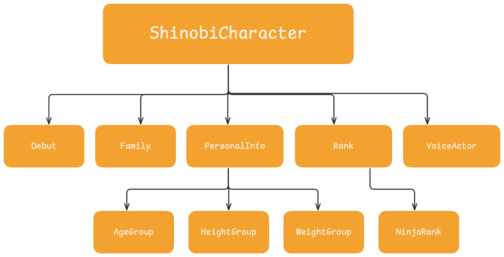

# JSON Fixtures

One of those concepts every professional developer eventually learns.


A **fixture** is simply **known, static data** used during **development** and **testing**.

Think of it as a snapshot of real data that never changes.

Instead of downloading Naruto from the API every time...
```
🌐 Internet
      │
      ▼
Dattebayo API
      │
      ▼
Naruto
```

... we save that response once.
```
Naruto.json
```

Now, whenenver we need Naruto:
```
Naruto.json
      │
      ▼
Decode
      │
      ▼
ShinobiCharacter
```

So,
- no internet.
- no waiting
- no API failures
- always the same result.

**Without fixtures**
- ❌ Unit tests fail
- ❌ SwiftUI previews fail
- ❌ Offline develpment impossible

**With Fixtures**
- ✅ Everything still works.


## I used Fixtures for 4 things

### 1. Unit Tests
```swift
let naruto = loadFixture("Naruto")
```
To test decoding

### 2. SwiftUI Previews
Instead of calling the API:
```swift
#Preview {
    CharacterDetailView(character: narutoFixture)
}
```
Instant preview.

### 3. Mock Networking
```swift
MockNetworkService
```
that returns fixtures instead of making HTTP requests.

That means our ViewModel doesn't even know whether data came from the internet or a file.

That's **dependency injection** in action.

### 4. Learning
I am able to inspect the JSON calmly.

"**What does Kakashi's rank look like?**" - Open the fixture.

No network request needed.


## What the JSON looks like

### Image



### RAW DATA SHAPE

```JSON
{
  "characters": [
    {
      "id": "Int",
      "name": "String",
      "images": ["String"],
      "debut": {
        "manga": "String",
        "anime": "String",
        "novel": "String",
        "movie": "String",
        "game": "String",
        "ova": "String",
        "appearsIn": "String"
      },
      "family": {
        "father": "String",
        "mother": "String",
        "son": "String",
        "daughter": "String",
        "wife": "String",
        "adoptive son": "String",
        "godfather": "String"
      },
      "jutsu": ["String"],
      "natureType": ["String"],
      "personal": {
        "birthdate": "String",
        "sex": "String",
        "age": {
          "Part I": "String",
          "Part II": "String",
          "Academy Graduate": "String"
        },
        "height": {
          "Part I": "String",
          "Part II": "String",
          "Blank Period": "String"
        },
        "weight": {
          "Part I": "String",
          "Part II": "String"
        },
        "bloodType": "String",
        "kekkeiGenkai": ["String"],
        "classification": ["String"],
        "tailedBeast": "String",
        "occupation": ["String"],
        "affiliation": ["String"],
        "team": ["String"],
        "clan": "String",
        "titles": ["String"]
      },
      "rank": {
        "ninjaRank": {
          "Part I": "String",
          "Gaiden": "String"
        },
        "ninjaRegistration": "String"
      },
      "tools": ["String"],
      "voiceActors": {
        "japanese": ["String"],
        "english": ["String"]
      }
    }
  ]
}
```